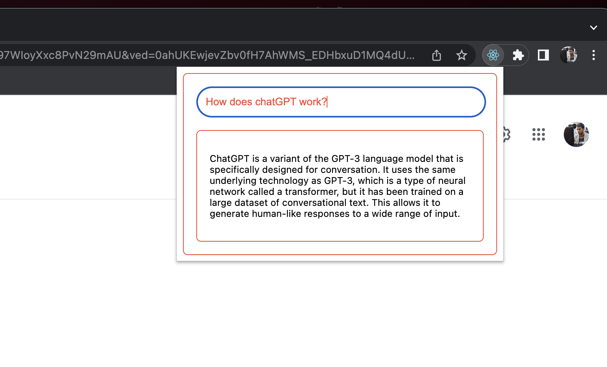

# AI Search Extension

This extension provides AI-generated responses using ChatGPT.

## Usage

In order to install the extension you need to:

- Clone the repo
  - `git clone https://github.com/Mikazakaryan/search-chat-gpt.git`
- Navigate to the directory and install dependencies and build the project:
  - `cd search-chat-gpt`
  - `yarn`
  - `yarn build`
- Now open up Google Chrome and navigate to: `chrome://extensions/`
- Click `Load Unpacked`
- Choose the `/build` directory inside `search-chat-gpt`
- Follow the instructions from the extension view to authenticate with OpenAI

You can now use the Extension both from the extension panel and also by searching for something in Google.

